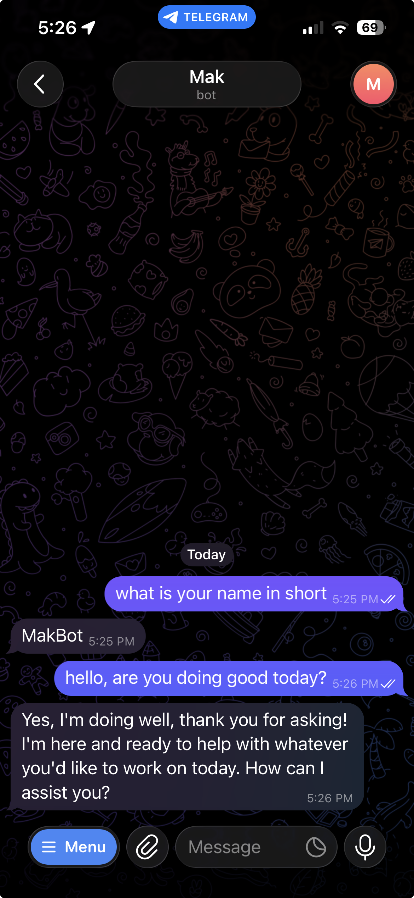

# Slim PA - Simple Personal AI Agent

This is a lightweight personal AI agent project with Telegram integration, built using Python and Node.js.



Inspired by [Openclaw](https://github.com/openclaw/openclaw) and [Pi Agent](https://github.com/badlogic/pi-mono/tree/main/packages/coding-agent).


### Key Features

- Telegram bot integration for user interaction

- Web search and content extraction capabilities

- Memory management for conversation context (NOT IMPLEMENTED YET)

- Modular architecture supporting extensions and customizations


### Dependencies

We mainly need docker. It will install all required dependencies. Following are a subset.
- Python 3.12+ (Telegram message dispacher and Pi Agent RPC)
- Node.js (for pi agent, skills and tools)


### Setup

1. Clone the repo `git clone git@github.com:makkader/slim-pa.git`
2. Change directory to slim-pa `cd slim-pa`
3. Copy `.env.example` to `.env` and populate
4. Run `docker compose build`
5. Run `Docker compose up -d` 

#### Get Telegram Bot Token
To get a telegram token you need to create a [Telegram Bot](https://core.telegram.org/bots/tutorial#obtain-your-bot-token). 

#### Example .env for Google

```
TELEGRAM_BOT_TOKEN = < Telegram token >
LLM_MODEL_NAME=gemini-3-flash-preview
LLM_PROVIDER=google 
```
Note: It supports many more providers such as antrhopic, openai etc. Check out full list of [providers](https://github.com/badlogic/pi-mono/blob/main/packages/coding-agent/docs/providers.md#environment-variables-or-auth-file).

#### Example .env for local model
I personally use it with local model with lmstudio. You can use with ollama as well. Here are the env variables for local settings.
```
TELEGRAM_BOT_TOKEN = < Telegram token >
LLM_MODEL_NAME=qwen/qwen3-coder-30b # really fast model and it runs in a 32GB+ Macbook pro.
LLM_PROVIDER=lmstudio 
```
Also you need to update [models.json](models.json) with local IP address and model id. 
The IP and model id can be found in lmstudio developer tab.
### Skills

The project includes a Web Tools skill that equips the agent with capabilities for retrieving and processing online information. This skill provides:

- **Web search functionality** powered by DuckDuckGo, enabling the agent to discover relevant resources and information across the internet.

- **Content extraction from web pages**, including sites that render content dynamically with JavaScript, allowing the agent to access and analyze fully loaded page data.


### Configuration

- `AGENTS.md` - Customizable agent-specific guidelines.

- `.pi/SYSTEM.md` - If you would like to modify the system prompt, use this file.


## Project Structure


### Main Components

- **src/** - Python source code for the agent

  - `agent/` - Agent implementation with RPC client functionality

  - `bot/` - Telegram bot integration

  - `config/` - Configuration management

  - `memory/` - Memory handling components (NOT IMPLEMENTED YET)


- **.pi/** - Project configuration and tools

  - `skills/web-tools/` - Web search and content extraction utilities built with Node.js

  - `extensions/` - Extension capabilities (currently empty)
